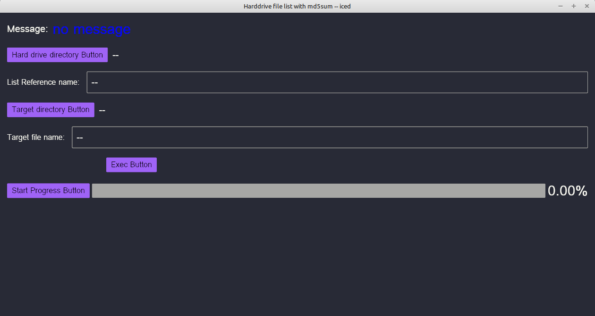

# hdmd5sum
Rust-Iced program: reads a hard drive directory and outputs a csv file with vertical bar separator and generates md5sum for each file

This program calls winitsize01 to get the smallest monitor size.

